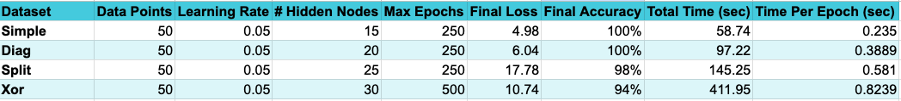
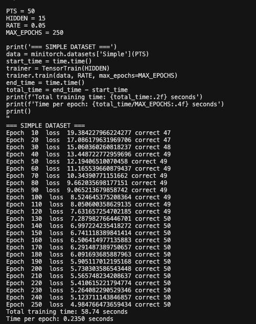
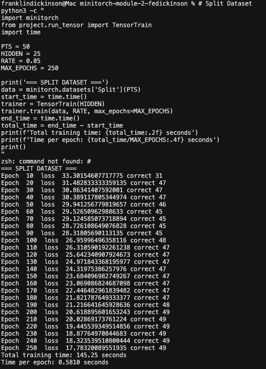
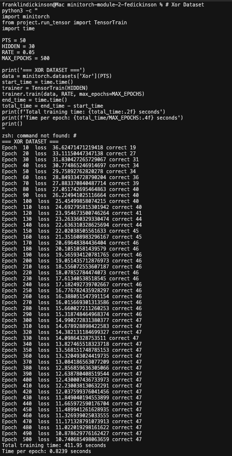

[](https://classroom.github.com/online_ide?assignment_repo_id=21019695&assignment_repo_type=AssignmentRepo)
# MiniTorch Module 2


* Docs: https://minitorch.github.io/

* Overview: https://minitorch.github.io/module2/module2/

This assignment requires the following files from the previous assignments. You can get these by running

```bash
python sync_previous_module.py previous-module-dir current-module-dir
```

The files that will be synced are:

        minitorch/operators.py minitorch/module.py minitorch/autodiff.py minitorch/scalar.py minitorch/module.py project/run_manual.py project/run_scalar.py


# Assignment 2.5 - Training Results





## Hyperparameters set up

Across all four samples, kept constant:
- The # of hidden layers (defined in the model function itself they all used)
- The # of datapoints considered (50)
- The Learning Rate (0.05)

In turn, I altered several other hyperparameters, with the goal of allowing a better chance of reaching 100% training accuracy for the more complex datasets.
- The number of epochs (held at 250 for Simple, Diagonal, and Split but moved to 500 for Xor)
- The # of hidden layers: allowed more as dataset patterns became more complex: 15 (simple) -> 20 (diagonal) -> 25 (Split) -> 30 (Xor)


## Results Analysis

Training Performance:
- Simple and Diag datasets achieved 100% accuracy easily
- Split reached 98% accuracy, close but not perfect
- Xor only reached 94% accuracy despite 500 epochs (2x the others)

Computational Cost:
Training time increased with hidden layer # of nodes: 0.24s -> 0.39s -> 0.58s ->0.82s per epoch
Total time scaled dramatically: 59s → 97s → 145s → 412s (based on hidden layer node size + # of epochs)

Main Takeway:
The harder datasets (Split, Xor)  need significantly more tuning - different learning rates, more hidden nodes, or many more epochs - to reach 100% accuracy.
The linear increase in hidden nodes wasn't sufficient for the nonlinear increase in problem difficulty.

## Full Training Output Logs

### Simple Dataset



### Diagonal Dataset


### Split Dataset



### Xor Dataset


